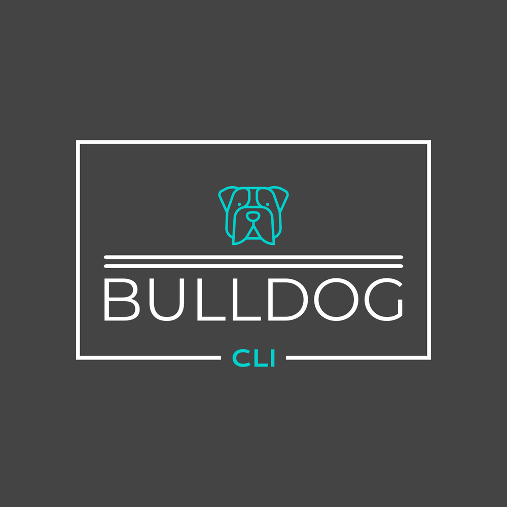
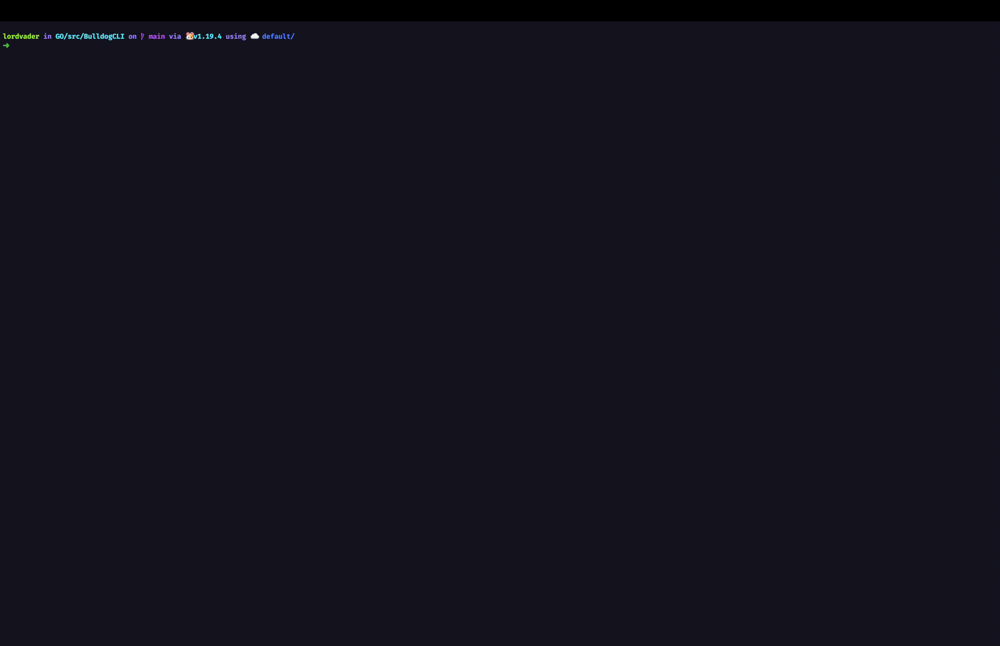

<!-- Improved compatibility of back to top link: See: https://github.com/jepifanio90/bulldog-cli/pull/73 -->

[![Contributors][contributors-shield]][contributors-url]
[![Forks][forks-shield]][forks-url]
[![Stargazers][stars-shield]][stars-url]
[![Issues][issues-shield]][issues-url]
[![MIT License][license-shield]][license-url]
[![Bulldog Health][bulldog-shield]][bulldog-url]
[![Netlify Status][netlify-shield]][netlify-url]

<!-- PROJECT LOGO -->
 

  

<h3 align="center">Bulldog CLI</h3>

  

    Bulldog is a CLI that empowers developers by giving them full control over their cloud accounts and pipelines
     
    <a href="https://github.com/jepifanio90/bulldog-cli"><strong>Explore the docs »</strong></a>
     
     
    <a href="https://github.com/jepifanio90/bulldog-cli/issues">Report Bug</a>
    ·
    <a href="https://github.com/jepifanio90/bulldog-cli/issues">Request Feature</a>
  

<!-- TABLE OF CONTENTS -->

  
Table of Contents

  <ol>
    <li>
      <a href="#about-the-project">About The Project</a>
      <ul>
        <li><a href="#built-with">Built With</a></li>
      </ul>
    </li>
    <li>
      <a href="#getting-started">Getting Started</a>
      <ul>
        <li><a href="#prerequisites">Prerequisites</a></li>
        <li><a href="#installation">Installation</a></li>
      </ul>
    </li>
    <li><a href="#usage">Usage</a></li>
    <li><a href="#roadmap">Roadmap</a></li>
    <li><a href="#contributing">Contributing</a></li>
    <li><a href="#license">License</a></li>
    <li><a href="#contact">Contact</a></li>
    <li><a href="#acknowledgments">Acknowledgments</a></li>
  </ol>

<!-- ABOUT THE PROJECT -->

## About The Project

Bulldog CLI pulls your resources from different cloud providers (AWS, Google, Azure + more to come) and your CI/CD
pipelines (Circle CI, Travis and Github Actions) and displays that data in a nice table format.

(<a href="#readme-top">back to top</a>)

### Built With

This section should list any major frameworks/libraries used to bootstrap your project. Leave any add-ons/plugins for the acknowledgements section. Here are a few examples.
* [![Angular][Angular.io]][Angular-url]

(<a href="#readme-top">back to top</a>)

<!-- ROADMAP -->
## Roadmap

- [x] Add Changelog
- [x] Add back to top links
- [ ] Add Additional Templates w/ Examples
- [ ] Add "components" document to easily copy & paste sections of the readme
- [ ] Multi-language Support
  - [ ] Chinese
  - [ ] Spanish

See the [open issues](https://github.com/othneildrew/Best-README-Template/issues) for a full list of proposed features (and known issues).

(<a href="#readme-top">back to top</a>)

<!-- CONTRIBUTING -->

## Contributing

Contributions are what make the open source community such an amazing place to learn, inspire, and create. Any
contributions you make are **greatly appreciated**.

If you have a suggestion that would make this better, please fork the repo and create a pull request. You can also
simply open an issue with the tag "enhancement".
Don't forget to give the project a star! Thanks again!

1. Fork the Project
2. Create your Feature Branch (`git checkout -b feature/AmazingFeature`)
3. Commit your Changes (`git commit -m 'Add some AmazingFeature'`)
4. Push to the Branch (`git push origin feature/AmazingFeature`)
5. Open a Pull Request

(<a href="#readme-top">back to top</a>)

<!-- LICENSE -->

## License

Distributed under the MIT License. See `LICENSE` for more information.

(<a href="#readme-top">back to top</a>)

<!-- MARKDOWN LINKS & IMAGES -->
<!-- https://www.markdownguide.org/basic-syntax/#reference-style-links -->

[contributors-shield]: https://img.shields.io/github/contributors/jepifanio90/bulldogio.svg?style=for-the-badge

[contributors-url]: https://github.com/jepifanio90/bulldogio/graphs/contributors

[forks-shield]: https://img.shields.io/github/forks/jepifanio90/bulldogio.svg?style=for-the-badge

[forks-url]: https://github.com/jepifanio90/bulldogio/network/members

[stars-shield]: https://img.shields.io/github/stars/jepifanio90/bulldogio.svg?style=for-the-badge

[stars-url]: https://github.com/jepifanio90/bulldogio/stargazers

[issues-shield]: https://img.shields.io/github/issues/jepifanio90/bulldogio.svg?style=for-the-badge

[issues-url]: https://github.com/jepifanio90/bulldogio/issues

[license-shield]: https://img.shields.io/github/license/jepifanio90/bulldogio.svg?style=for-the-badge

[license-url]: https://github.com/jepifanio90/bulldogio/blob/master/LICENSE.txt

[bulldog-shield]: https://img.shields.io/github/actions/workflow/status/jepifanio90/bulldogio/prod.yml?style=for-the-badge

[bulldog-url]: https://github.com/JEpifanio90/BulldogIO/actions/workflows/prod.yml

[netlify-shield]: https://api.netlify.com/api/v1/badges/c4ebec23-5ba3-4c12-b768-642a487ec935/deploy-status?style=for-the-badge

[netlify-url]: https://app.netlify.com/sites/relaxed-hummingbird-f7ba30/deploys

[Angular.io]: https://img.shields.io/badge/Angular-DD0031?style=for-the-badge&logo=angular&logoColor=white

[Angular-url]: https://angular.io/
